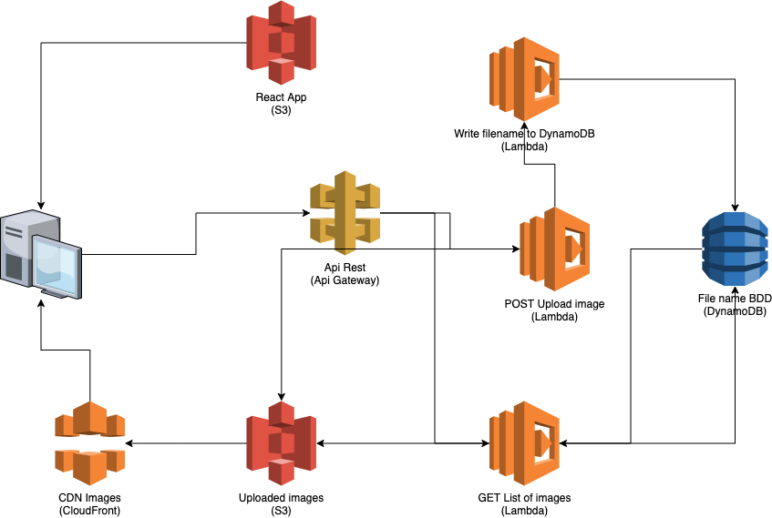

# Serverless Image Uploader

## Prerequisites

- Python3 (3.9 is recommended).
- NodeJS and Npm (14.18 and 6.14)
- The AWS CDK
- An AWS Account with your Access Key and Secret Access Key.


## Project architecture

```
serveless-image-uploader
|   README.md
|---front-app # The Front-End React App
|---lambda
|   |---file_to_ddb.py
|   |---hello_world.py
|   |---list_files.py
|   |---upload-file.py
|---scripts # You can run this script to populate example images
|   |---upload_images.py
|   |---assets # The example assets
|---serveless_image_uploader # Your AWS infra lives here
```


## AWS Infrastructure




## How to run the project

### Setting up the React application

- `cd front-app` - Go the Front-end directory project
- `yarn` - Install the dependencies
- `yarn start` - Launch the React project
- `yarn build` - Build a production version of the project. **You will need to
  do that if you want to deploy the project to AWS**


### Installing the CDK, set up the env and deploy it to AWS

- `npm install -g aws-cdk`: Install the AWS CDK
- `python3 -m venv .venv`: Create a virtualenv` on MacOS and Linux
- `source .venv/bin/activate`: Activate your virtualenv
- `% .venv\Scripts\activate.bat`: If you are on Windows, you would activate
  your virtualenv with this command.
- `pip install -r requirements.txt`: Once the virtualenv is activate, 
  you can install the required dependencies.
- `cdk bootstrap`: Bootstrap the AWS CDK
- `cdk synth`: Synthethise the CDK code into a CloudFormation template
- `cdk deploy`: Deploy the project on AWS.

**WARNING**: you need to build your React application before runing the `cdk
deploy` command.


### Adding the API Gateway URL

Before you go try upload images, copy the output of the deploy command, it
looks like this one: **https://4ooi3ccx66.execute-api.us-east-1.amazonaws.com/prod**

Copy and paste this link in the following files:
- `scripts/upload_images.py` - It's the BASE_URL
- `front-app/src/constants.ts`


### Tearing down your AWS resources

- `cdk destroy`: delete the resources from your AWS account.


## Miscalenous

There is `script` folder in the project. It contains images and a python script
and will populate some data to the project.

- `python scripts/upload_images.py` - Upload example images.

